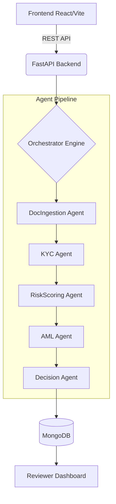

# 🏦 OnboardAI: Agentic AI for Intelligent Account Opening

    

**OnboardAI** is an end-to-end AI-powered account onboarding platform engineered for modern fintechs and neo-banks. It leverages autonomous AI agents arranged in a LangGraph-style pipeline to instantly process, verify, and underwrite new user applications.

By combining deterministic compliance rules with Large Language Model (LLM) reasoning, OnboardAI reduces manual review times from days to seconds while maintaining strict AML/KYC regulatory standards.

---

## ✨ Key Features

- **🤖 Multi-Agent Pipeline**: Specialized AI agents handle Doc Ingestion, KYC Verification, Risk Scoring, AML Screening, and Final Decision making.
- **📄 Simulated & Real Integrations**: Instantly switch between simulated API responses (for rapid testing) and real-world compliance providers (e.g., AWS Textract, Onfido, ComplyAdvantage).
- **🧠 LLM Underwriting reasoning**: GPT-4o synthesizes risk signals into plain-English, explainable underwriting decisions.
- **🛡️ Reviewer Dashboard**: Human-in-the-loop dashboard for compliance officers to review applications flagged for `MANUAL_REVIEW`.
- **📜 Immutable Audit Trail**: Every agent invocation, decision, and risk score is permanently logged to an audit trail for regulatory compliance.
- **🎨 Modern Glassmorphic UI**: A stunning, responsive applicant frontend built with React, Vite, and Framer Motion.

---

## 🏗️ System Architecture



### Tech Stack
* **Frontend**: React 18, TypeScript, Vite, Framer Motion, Zustand, React Query, Lucide Icons.
* **Backend**: Python 3.10+, FastAPI, PyMongo, Pydantic, Jose (JWT), Bcrypt, OpenAI SDK.
* **Database**: MongoDB (Atlas or local).
* **Infrastructure**: Docker, Docker Compose.

---

## 🚀 Quick Start (Local Development)

### Prerequisites
- Docker & Docker Compose
- Node.js 18+ (if running frontend outside Docker)
- Python 3.10+ (if running backend outside Docker)

### 1. Environment Configuration
Clone the repository and set up your environment variables:

```bash
git clone https://github.com/yourusername/Agentic-AI-for-Intelligent-Account-Opening-Onboarding.git
cd Agentic-AI-for-Intelligent-Account-Opening-Onboarding

# Copy the example backend config
cp .env.example .env

# Copy the example frontend config
cp frontend/.env.example frontend/.env
```

**Key `.env` Variables:**
* `MONGODB_URL`: Your MongoDB connection string (e.g., `mongodb://localhost:27017` or Atlas URL).
* `OPENAI_API_KEY`: Required if you want LLM-generated decision reasoning.
* `SIMULATE_OCR` / `SIMULATE_KYC` / `SIMULATE_AML`: Set to `true` to bypass external API calls and use internal simulation engines.

### 2. Run with Docker Compose

The easiest way to launch the entire stack (Database, Backend, Frontend) is via Docker Compose:

```bash
docker-compose up --build
```

### 3. Access the Platform

Once the containers are running, access the services at:

| Service | Address |
|---|---|
| **Applicant Frontend** | [http://localhost:3000](http://localhost:3000) |
| **Backend API** | [http://localhost:8000](http://localhost:8000) |
| **API Documentation (Swagger)** | [http://localhost:8000/docs](http://localhost:8000/docs) |

*(Note: Create an account via the frontend `/register` route. Select "Administrator" or "Reviewer" role to access the internal dashboards).*

---

## ☁️ Deployment Guide

OnboardAI is designed to be easily deployed to modern cloud PaaS providers.

### 1. Backend (Render)
The backend is a standard ASGI FastAPI application.
1. Connect your GitHub repository to Render as a **Web Service**.
2. **Build Command**: `pip install -r backend/requirements.txt`
3. **Start Command**: `uvicorn backend.main:app --host 0.0.0.0 --port $PORT`
4. Add the required Environment Variables in the Render dashboard (ensure `ALLOWED_ORIGINS` includes your frontend URL).

### 2. Frontend (Vercel)
The frontend is a static Vite application.
1. Connect your GitHub repository to Vercel.
2. Set the Root Directory to `frontend`.
3. Vercel will automatically detect Vite and configure the build commands.
4. Add the Environment Variable `VITE_API_URL` pointing to your deployed Render backend URL.

---

## 🤖 The Agent Pipeline

The core intelligence of OnboardAI lives in `backend/agents`. The orchestrator runs these agents sequentially:

| Agent | Responsibility | Simulation Behavior |
|---|---|---|
| **DocIngestion** | Extracts structured fields from uploaded ID documents. | Generates realistic mock OCR data based on applicant inputs. |
| **KYC Check** | Verifies identity fields, calculates confidence scores. | Applies rule-based penalties for mismatches or expired documents. |
| **Risk Scoring** | Evaluates financial/demographic risk (0.0 - 1.0 score). | Checks age, income, and nationality against defined risk thresholds. |
| **AML Screen** | Screens against Sanctions (OFAC) and PEP lists. | Fuzzy matches against an internal mock watchlist. |
| **Decision** | Synthesizes all signals into a final action. | Falls back to deterministic rules if OpenAI API fails or is unset. |

---

## 🔒 Security & Compliance

- **Role-Based Access Control (RBAC)**: Distinct permissions for `user`, `reviewer`, and `admin`.
- **JWT Authentication**: Secure stateless authentication for the REST API.
- **Immutable Audit Logs**: The `/audit` subsystem prevents tampering with the decision history.
- **Password Hashing**: Bcrypt is used for all credential storage.

---

## 🧪 Testing

To run the backend test suite:

```bash
cd backend
python -m venv .venv
source .venv/bin/activate  # On Windows: .venv\Scripts\activate
pip install -r requirements.txt
pytest tests/ -v
```

---

*Built for the future of compliant, frictionless fintech onboarding.*
